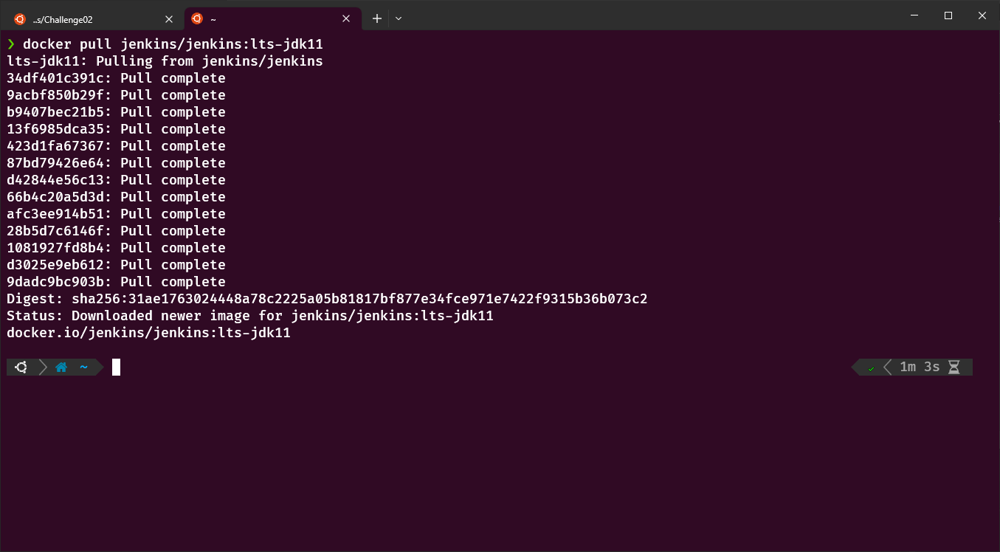
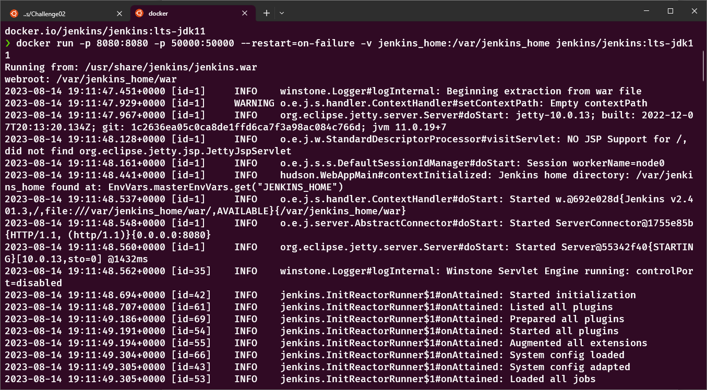
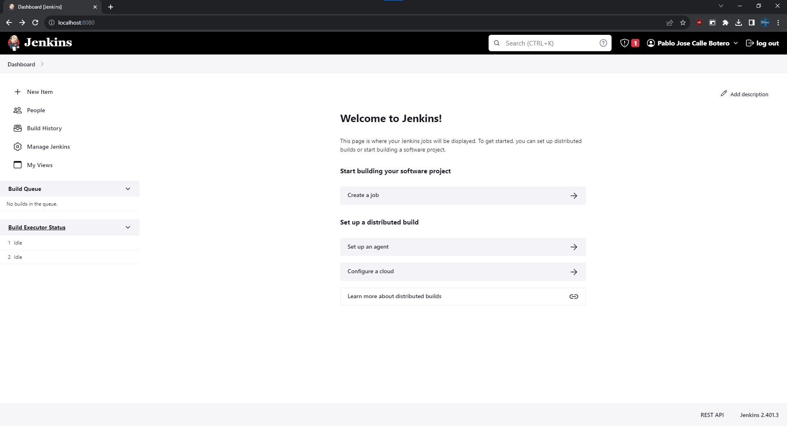

# Challenge 2

1) Pull the docker image  with: <code>docker pull jenkins/jenkins:lts-jdk11</code>
2) Run the container with: <code>docker run -p 8080:8080 -p 50000:50000 --restart=on-failure -v jenkins_home:/var/jenkins_home jenkins/jenkins:lts-jdk11</code> 
3) Access via the web browser
## Images 

	
	
	

